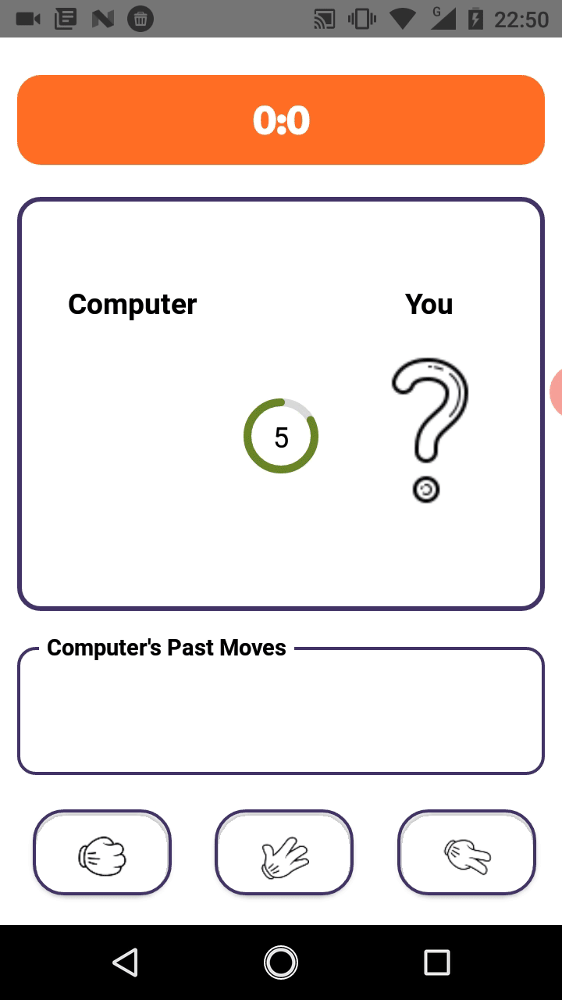

# Rock Paper Scissors in React Native 

An implementation of *Rock-Paper-Scissors* game in *React Native* (without Expo). 

Code submission for the 3rd week's assignment of the 2020 React Native course organised by Facebook Developers' Circle Hanoi.

## Screenshots

## Installation: Brief Guidance

My JS project manager CLI by choice is `Yarn`. You also need to have `react-native` CLI pre-installed on your machine.

0. Clone this repo: `git clone https://github.com/mnhthng-thms/Rock-Paper-Scissors-ReactNative.git`
1. In the project directory, initialise and get project dependencies installed: `yarn install`

These steps below are to get the project run on Android devices (Prerequisite: you need to already have Android Studio SDK CLI developer tools installed and added to your OS's $PATH variable)

2. Evoke *Android Debug Bridge* from command line: `adb devices`
3. In the project directory, start *Metro Bundler* server from command line: `yarn start`
4. While the *Metro Bundler* is running, execute `yarn android` to get the app built for debugging.

## Legal

This source code is licensed under [MIT License](https://github.com/mnhthng-thms/Rock-Paper-Scissors-ReactNative/blob/master/LICENSE.md). Copyright © 2020 [MinhTu Thomas Hoang](https://github.com/mnhthng-thms).

In short:

- The author permits reusing this source code for any purposes, including commercial and for-profit ones, on condition that the copies of this source code _must_ include a MIT copyright notice. (This project has also been benefited from other MIT-licensed open source technologies.)
- The author is not responsible for any possible malicious uses of this source code.
