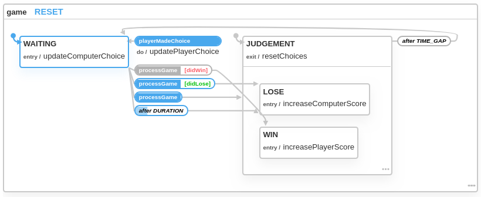

# About My Approach

The business logic of this application is interpreted as a finite state machine. This state machine is visualised as in the diagram below:

This blueprint is implemented into this program using [**XState**](https://xstate.js.org/docs/) as shown in [`gameMachine.js`](./gameMachine.js). 

## Advantages of this approach

- The concept of *finite state machine* is based on [well-established computer science researches](https://www.inf.ed.ac.uk/teaching/courses/seoc/2005_2006/resources/statecharts.pdf). Hence, `XState` doesn't fall into any inconsistencies and overly-complex hacks introduced by `Redux`.
- State chart visualisation make it easier to reason about the program's business logic and detect logical faults beforehand. 
- This state machine implementation is completed decoupled to other React code files, which make it effortlessly easy to test and debug the game's business logic.

